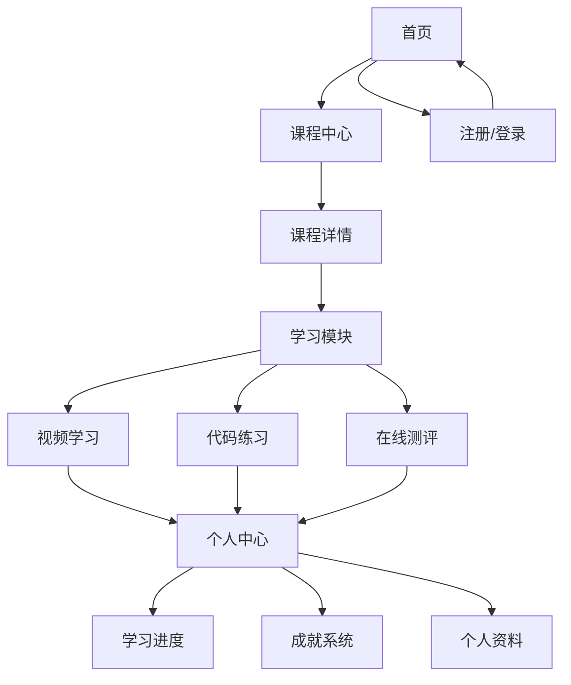

## 1. 产品概述
数据分析在线教育平台是专为商务数据分析与应用专业学生设计的在线学习系统，提供完整的课程体系和互动式学习体验。
- 主要解决商务数据分析专业学生的学习需求，提供系统化的课程内容和实践机会
- 目标是成为商务数据分析领域的优质在线教育平台，帮助学生掌握实用的数据分析技能

## 2. 核心功能

### 2.1 用户角色
| 角色 | 注册方式 | 核心权限 |
|------|---------------------|------------------|
| 学生 | 邮箱/手机号注册 | 浏览课程、参与学习、完成练习和测评、查看个人成就 |
| 管理员 | 后台创建 | 管理课程内容、用户、查看学习数据 |

### 2.2 功能模块
1. **首页**：平台介绍、课程分类、推荐课程、最新动态
2. **课程中心**：课程列表、课程详情、学习进度
3. **学习模块**：视频学习、文档阅读、代码练习、在线测评
4. **个人中心**：学习进度、成就系统、个人资料

### 2.3 页面详情
| 页面名称 | 模块名称 | 功能描述 |
|-----------|-------------|---------------------|
| 首页 | 英雄区 | 平台介绍、核心价值展示、快速入口 |
| 首页 | 课程分类 | 按数据分���领域分类展示课程 |
| 首页 | 推荐课程 | 基于用户兴趣推荐相关课程 |
| 课程中心 | 课程列表 | 展示所有课程，支持筛选和搜索 |
| 课程中心 | 课程详情 | 课程介绍、章节内容、学习人数 |
| 学习模块 | 视频学习 | 高清视频播放、进度记录、笔记功能 |
| 学习模块 | 代码练习 | 在线代码编辑器、实时运行、自动评测 |
| 学习模块 | 在线测评 | 多种题型、限时测试、自动评分 |
| 个人中心 | 学习进度 | 展示所有课程的学习状态和进度 |
| 个人中心 | 成就系统 | 徽章、等级、排行榜、学习证书 |
| 个人中心 | 个人资料 | 基本信息、学习统计、设置 |

## 3. 核心流程
用户注册登录后，可以浏览课程中心选择感兴趣的课程，进入学习模块进行视频学习、代码练习和在线测评。系统会记录学习进度和成就，用户可以在个人中心查看自己的学习状态和获得的徽章。

## 4. 用户界面设计
### 4.1 设计风格
- 主色调：蓝色(#165DFF)和白色(#FFFFFF)，辅以浅灰色(#F5F7FA)作为背景
- 按钮风格：圆角矩形，主按钮使用主色调，悬停效果明显
- 字体：标题使用无衬线字体，正文使用清晰易读的字体
- 布局风格：卡片式布局，顶部导航栏，响应式设计
- 图标风格：简约现代的线性图标，搭配适当的色彩

### 4.2 页面设计概览
| 页面名称 | 模块名称 | UI元素 |
|-----------|-------------|-------------|
| 首页 | 英雄区 | 大型背景图，醒目标题和副标题，行动号召按钮，平滑滚动效果 |
| 首页 | 课程分类 | 卡片式分类展示，图标+文字，悬停效果，响应式网格布局 |
| 课程中心 | 课程列表 | 卡片式课程展示，包含课程封面、标题、简介、进度条，支持筛选和排序 |
| 学习模块 | 视频学习 | 视频播放器，章节导航，笔记功能，进度记录，全屏模式 |
| 学习模块 | 代码练习 | 代码编辑器，运行按钮，结果展示区，错误提示，语法高亮 |
| 个人中心 | 成就系统 | 徽章墙，等级展示，排行榜，证书展示，动画效果 |

### 4.3 响应性
- 采用桌面优先设计，同时支持平板和移动设备
- 在小屏幕设备上优化布局，确保内容清晰可读
- 触摸设备优化，增大点击区域，支持手势操作

### 4.4 3D场景指导
- 不适用，本项目主要为2D界面设计