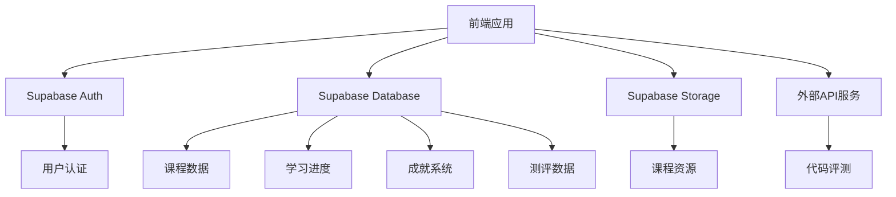
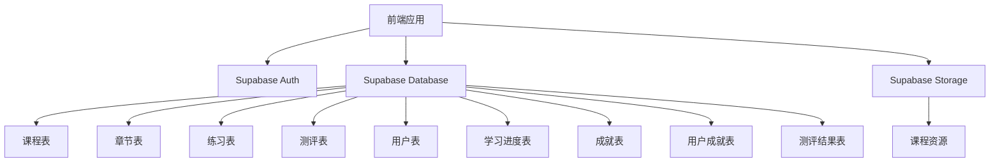
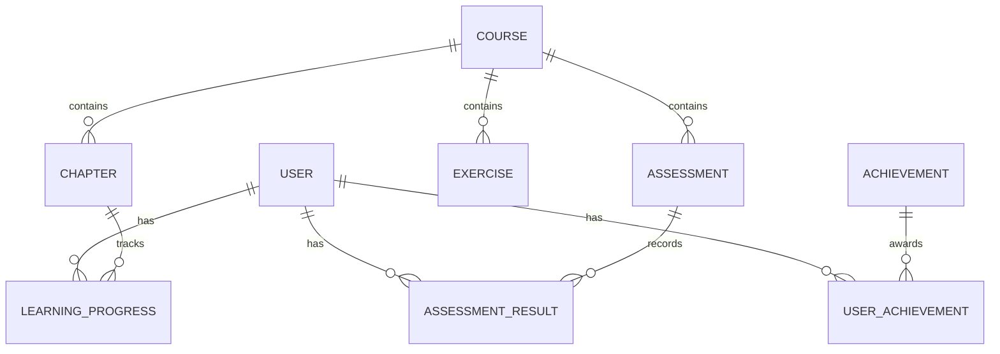

## 1. 架构设计


## 2. 技术描述
- 前端：React@18 + TypeScript + TailwindCSS@3 + Vite
- 初始化工具：vite-init
- 后端：Supabase (提供认证、数据库、存储服务)
- 数据库：Supabase (PostgreSQL)
- 外部服务：CodeSandbox API (代码评测)

## 3. 路由定义
| 路由 | 目的 |
|-------|---------|
| / | 首页 |
| /courses | 课程中心 |
| /courses/:id | 课程详情 |
| /learn/:courseId/:chapterId | 学习模块 |
| /practice/:courseId/:exerciseId | 代码练习 |
| /assessment/:courseId/:assessmentId | 在线测评 |
| /profile | 个人中心 |
| /profile/achievements | 成就系统 |
| /profile/settings | 个人设置 |
| /login | 登录页面 |
| /register | 注册页面 |

## 4. API定义
### 4.1 前端API调用
- Supabase Auth API：用户注册、登录、登出
- Supabase Database API：课程数据、学习进度、成就系统
- Supabase Storage API：课程资源管理
- CodeSandbox API：代码评测服务

### 4.2 数据模型
```typescript
// 用户模型
interface User {
  id: string;
  email: string;
  name: string;
  avatar: string;
  level: number;
  experience: number;
  createdAt: string;
}

// 课程模型
interface Course {
  id: string;
  title: string;
  description: string;
  coverImage: string;
  category: string;
  level: 'beginner' | 'intermediate' | 'advanced';
  duration: number;
  enrolledCount: number;
  createdAt: string;
}

// 章节模型
interface Chapter {
  id: string;
  courseId: string;
  title: string;
  order: number;
  content: string;
  videoUrl: string;
  duration: number;
}

// 练习模型
interface Exercise {
  id: string;
  courseId: string;
  chapterId: string;
  title: string;
  description: string;
  difficulty: 'easy' | 'medium' | 'hard';
  starterCode: string;
  testCases: string;
  solution: string;
}

// 测评模型
interface Assessment {
  id: string;
  courseId: string;
  title: string;
  description: string;
  duration: number;
  questions: Question[];
  passingScore: number;
}

// 问题模型
interface Question {
  id: string;
  assessmentId: string;
  type: 'multiple-choice' | 'true-false' | 'code';
  content: string;
  options?: string[];
  correctAnswer: string;
  points: number;
}

// 学习进度模型
interface LearningProgress {
  id: string;
  userId: string;
  courseId: string;
  chapterId: string;
  completed: boolean;
  progress: number;
  lastAccessed: string;
}

// 成就模型
interface Achievement {
  id: string;
  name: string;
  description: string;
  icon: string;
  rarity: 'common' | 'uncommon' | 'rare' | 'epic' | 'legendary';
  requirement: string;
}

// 用户成就模型
interface UserAchievement {
  id: string;
  userId: string;
  achievementId: string;
  unlockedAt: string;
}

// 测评结果模型
interface AssessmentResult {
  id: string;
  userId: string;
  assessmentId: string;
  score: number;
  passed: boolean;
  completedAt: string;
}
```

## 5. 服务器架构图


## 6. 数据模型
### 6.1 数据模型定义


### 6.2 数据定义语言
```sql
-- 用户表
CREATE TABLE users (
  id UUID PRIMARY KEY,
  email VARCHAR(255) UNIQUE NOT NULL,
  name VARCHAR(255),
  avatar VARCHAR(255),
  level INTEGER DEFAULT 1,
  experience INTEGER DEFAULT 0,
  created_at TIMESTAMP DEFAULT NOW()
);

-- 课程表
CREATE TABLE courses (
  id UUID PRIMARY KEY,
  title VARCHAR(255) NOT NULL,
  description TEXT,
  cover_image VARCHAR(255),
  category VARCHAR(100),
  level VARCHAR(20),
  duration INTEGER,
  enrolled_count INTEGER DEFAULT 0,
  created_at TIMESTAMP DEFAULT NOW()
);

-- 章节表
CREATE TABLE chapters (
  id UUID PRIMARY KEY,
  course_id UUID REFERENCES courses(id),
  title VARCHAR(255) NOT NULL,
  "order" INTEGER,
  content TEXT,
  video_url VARCHAR(255),
  duration INTEGER
);

-- 练习表
CREATE TABLE exercises (
  id UUID PRIMARY KEY,
  course_id UUID REFERENCES courses(id),
  chapter_id UUID REFERENCES chapters(id),
  title VARCHAR(255) NOT NULL,
  description TEXT,
  difficulty VARCHAR(20),
  starter_code TEXT,
  test_cases TEXT,
  solution TEXT
);

-- 测评表
CREATE TABLE assessments (
  id UUID PRIMARY KEY,
  course_id UUID REFERENCES courses(id),
  title VARCHAR(255) NOT NULL,
  description TEXT,
  duration INTEGER,
  passing_score INTEGER,
  questions JSONB
);

-- 学习进度表
CREATE TABLE learning_progress (
  id UUID PRIMARY KEY,
  user_id UUID REFERENCES users(id),
  course_id UUID REFERENCES courses(id),
  chapter_id UUID REFERENCES chapters(id),
  completed BOOLEAN DEFAULT FALSE,
  progress INTEGER DEFAULT 0,
  last_accessed TIMESTAMP DEFAULT NOW()
);

-- 成就表
CREATE TABLE achievements (
  id UUID PRIMARY KEY,
  name VARCHAR(255) NOT NULL,
  description TEXT,
  icon VARCHAR(255),
  rarity VARCHAR(20),
  requirement TEXT
);

-- 用户成就表
CREATE TABLE user_achievements (
  id UUID PRIMARY KEY,
  user_id UUID REFERENCES users(id),
  achievement_id UUID REFERENCES achievements(id),
  unlocked_at TIMESTAMP DEFAULT NOW()
);

-- 测评结果表
CREATE TABLE assessment_results (
  id UUID PRIMARY KEY,
  user_id UUID REFERENCES users(id),
  assessment_id UUID REFERENCES assessments(id),
  score INTEGER,
  passed BOOLEAN,
  completed_at TIMESTAMP DEFAULT NOW()
);

-- 权限设置
GRANT SELECT ON ALL TABLES TO anon;
GRANT ALL PRIVILEGES ON ALL TABLES TO authenticated;

-- 创建索引
CREATE INDEX idx_learning_progress_user_course ON learning_progress(user_id, course_id);
CREATE INDEX idx_user_achievements_user ON user_achievements(user_id);
CREATE INDEX idx_assessment_results_user ON assessment_results(user_id);
CREATE INDEX idx_courses_category ON courses(category);
```